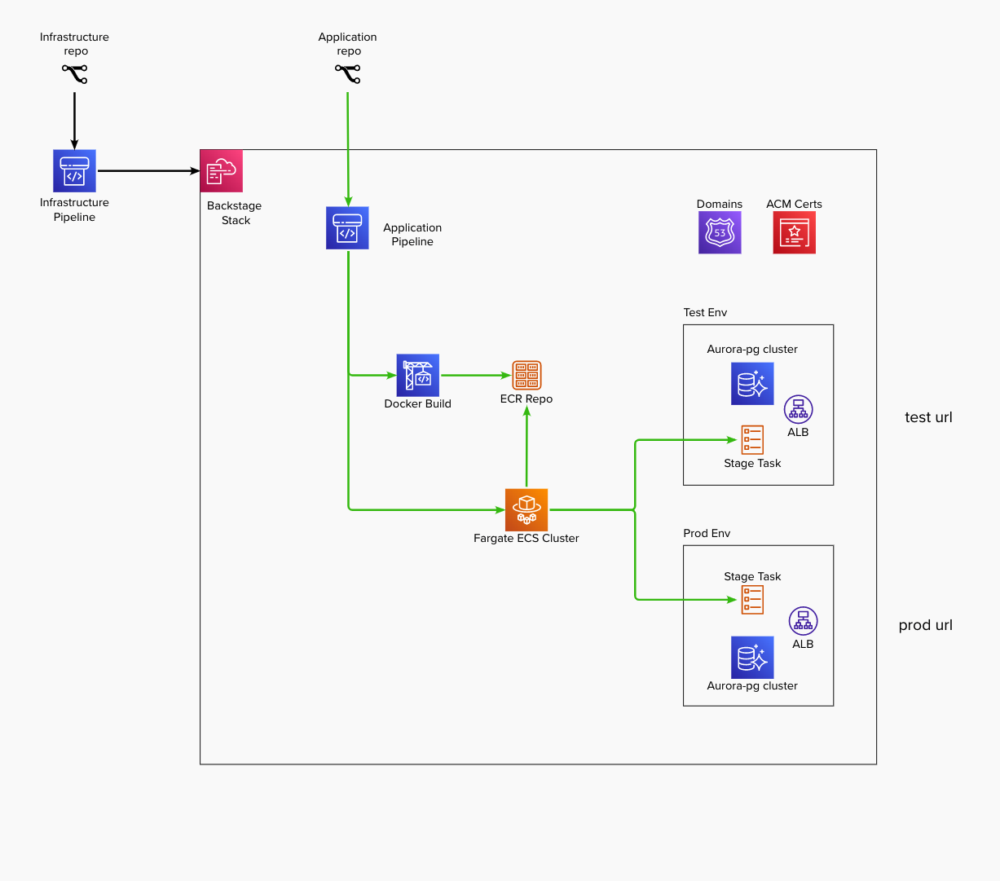

# Pipelines 
This repo has CDK stacks which creates two separate pipelines for the backstage deployment.
Each pipeline has a different source and controls a different aspect of the backstage deployment.

  - [Infrastructure Pipeline](#infrastructure-pipeline)
  - [Application Pipeline](#application-pipeline)

## Diagram of pipelines and stacks

## Infrastructure Pipeline
The infrastructure pipeline is the only part of the deployment that requires an inital manual deployment.
This pipeline is self updating and deploys all of the supporting infrastructure to host the backstage container app as well as deploys the application pipeline detailed below. 

This pipeline uses the `infra-buildspec.yaml` to specify the actions for its codebuild stage, which synthesizes the cdk stacks into cloudformation templates. The subsequent deployment stages, one for each stack, then use a create/replace changeset action to deploy the cloudformation changes to the deployment account. 

## Application Pipeline
The application pipeline is created in the backstage-infra stack deployed by the infrastructure pipeline.
This pipeline is only intended to build and update the containers running in ECS fargate based on changes in the application code, so that we can maintain the two aspects separately and cleanly. This way the application code is not required to contain information about its deployment infrastructure. This allows us to cleanly test and develop the applicaton code locally. 

The app pipeline uses a codebuild stage and the `app-buildspec.yml` file to perform the docker image build, and push the latest image to the ECR repository. We try to reduce the build time by pulling and specifying cached images for the build. 

The subsequent stages then use the `ECS Deploy` action to create an updated `imagedefinitions.json` file and notify the ECS service and task definitions of a pending change in container versions. ECS then takes over to cleanly swap out running containers in each of the stage tasks, so no downtime occurs. 

There is an optional manual approval action inserted before the deployment for prod stage, which allows us to check the test stage before promoting. 
